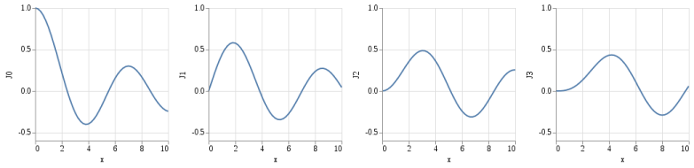
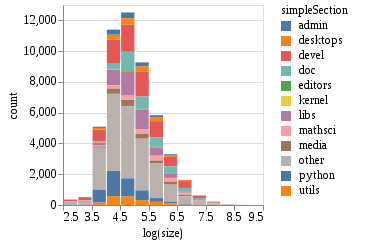

# VL4S (Vega-Lite for Scala)

vl4s is a tool for automatically generating
a [Scala](https://www.scala-lang.org) library
via which interactive plots can be generated conforming
to the [Vega-Lite](https://vega.github.io/vega-lite) specification.



vl4s is intended to allow the
JSON [schema](https://github.com/vega/schema/tree/master/vega-lite)
provided by Vega-Lite to be converted into a Scala API
which provides natural, and type-safe,
ways of describing plots in Scala and emitting Vega-Lite JSON documents
that can be embedded in web-pages.
This is an alternative approach to that of [Vegas](https://www.vegas-viz.org/),
and [Argus](https://github.com/aishfenton/Argus), aiming to create
a DSL that is closer to the structure of the underlying JSON schema
(hence, hopefully, easier to document) and allowing export
of a [json4s](http://json4s.org) datastructure that could
be customized by the user.

The build-system is managed by [SBT](http://www.scala-sbt.org/),
and consists of two projects:
* the "root" project, which must be compiled and run to generate
  the file "vl4s/src/main/scala/auto-vega.scala"
  from either the upstream VegaLite schema based on a version-number
  supplied with the "-V" command-line argument,
  or a local copy of a schema file (e.g. "v2.0.3.json")
* the "vl4s" project, which will build the VegaLite API itself,
  and allows creation of VegaLite JSON documents from
  a user-supplied plot specification.

The tool is currently at an early stage of development,
but already supports the entire Vega-Lite 2.0 grammar,
including generation of interactive line plots,
and histograms with aggregation operations, repeats, selections, etc.


## Example



Given a tab-separated datafile representing the sizes of packages
in a [Debian](https://www.debian.org) system,
one can generate an interactive Vega-Lite plot
using a recipe such as:
```scala
import org.json4s._
import org.json4s.native.JsonMethods.{ pretty, render }
import uk.rwpenney.vl4s._
import uk.rwpenney.vl4s.ShortcutImplicits._

val spec = SimpleSpec() .
  data("apt-package-sizes.tsv") .
  selection(
    Map("chosen" -> SingleSelection() .
                      encodings(Seq(SingleDefChannel.color)) .
                      vtype(SingleSelection_type.single))) .
  mark(Mark.bar) .
  encoding(EncodingWithFacet() .
    >> { enc => enc .
      x(enc.XYaxisDef .
        axis(Axis() .
          title("log(size)")) .
        field("logSize") .
        vtype(Type.quantitative) .
        bin(BinParams() .
          maxbins(20))) .
      y(enc.XYaxisDef .
        axis(Axis() .
          title("count")) .
        field("*") .
        vtype(Type.quantitative) .
        aggregate(AggregateOp.count)) .
      color(MarkPropValueDefWithCondition() .
        condition(Conditional_MarkPropFieldDef_() .
          field("simpleSection") .
          selection("chosen") .
          vtype(Type.nominal)) .
        value("grey"))
    }
  )

val json = spec.toJValue
println(pretty(render(json)))
```
This will generate a JSON document of the following form:
```json
{
  "data":{
    "url":"apt-package-sizes.tsv"
  },
  "selection":{
    "chosen":{
      "encodings":["color"],
      "type":"single"
    }
  },
  "mark":"bar",
  "encoding":{
    "x":{
      "axis":{
        "title":"log(size)"
      },
      "field":"logSize",
      "type":"quantitative",
      "bin":{
        "maxbins":20.0
      }
    },
    "y":{
      "axis":{
        "title":"count"
      },
      "field":"*",
      "type":"quantitative",
      "aggregate":"count"
    },
    "color":{
      "condition":{
        "field":"simpleSection",
        "selection":"chosen",
        "type":"nominal"
      },
      "value":"grey"
    }
  }
}
```
Alternatively, one can use the methods in the ExportImplicits object
to wrap this in an HTML `<div>` for inclusion in a web-page.
